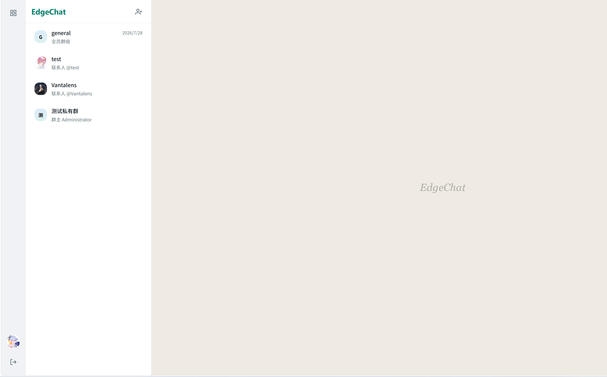
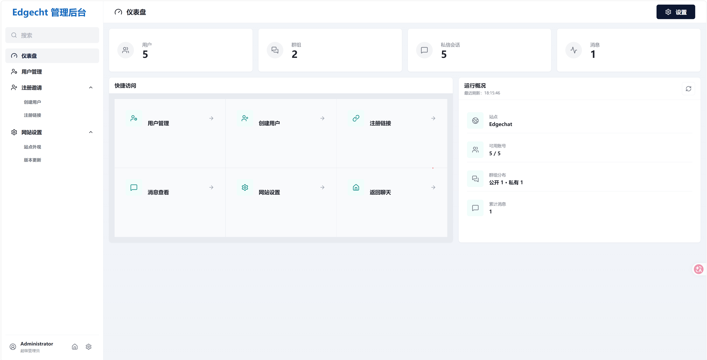

<div align="center">
  

  <h3>Cloudflare フルスタックで作られたモダンなチーム向けチャットシステム</h3>
  <p>アカウント体系 · 公開/プライベートグループ · ダイレクトメッセージ · リアルタイムメッセージ · ファイルアップロード · 管理ダッシュボード</p>

  <p>
    
    
    
    
    
  </p>
  <p>
    
    
    
    
    
    
  </p>

  <p>
    <a href="README.md">中文</a> ·
    <a href="README.en.md">English</a> ·
    <a href="README.ja.md"><b>日本語</b></a> ·
    <a href="https://edgechat-demo.wcjxxgaq.workers.dev">オンラインデモ</a> ·
    <a href="https://echat.azora.top/">プロジェクトドキュメント</a> ·
    <a href="https://t.me/EdgeChatlounge">Telegram コミュニティ</a>
  </p>

  > ***これは 1,000万人未満のチームに最適な Cloudflare チャットルームかもしれません***
</div>

<br />

EdgeChat は Cloudflare 上にデプロイするチーム向けチャットシステムです。アカウント体系、公開グループ、プライベートグループ、ダイレクトメッセージ、リアルタイムメッセージ、ファイルアップロード、管理ダッシュボードをひととおり揃えています。目標は明確です。Cloudflare エコシステムの中で、できるだけ低い運用コストで、そのまま本番投入できるサイト内 IM を動かすことです。

## 目次

- [インターフェースプレビュー](#インターフェースプレビュー)
- [オンラインデモ](#オンラインデモ)
- [注目機能：Telegram 双方向メッセージブリッジ](#注目機能telegram-双方向メッセージブリッジ)
- [なぜ EdgeChat なのか](#なぜ-edgechat-なのか)
- [機能](#機能)
- [技術スタック](#技術スタック)
- *[Telegram コミュニティ](#telegram-コミュニティ)*
- [デプロイ](#デプロイ)
- [クイックスタート](#クイックスタート)
- [プロジェクト構成](#プロジェクト構成)
- [コントリビューション](#コントリビューション)
- [Star History](#star-history)
- [ライセンス](#ライセンス)

## インターフェースプレビュー

<table>
  <tr>
    <td width="50%" align="center"><strong>チャット画面</strong></td>
    <td width="50%" align="center"><strong>管理ダッシュボード</strong></td>
  </tr>
  <tr>
    <td width="50%"></td>
    <td width="50%"></td>
  </tr>
</table>

## オンラインデモ

**[edgechat-demo.wcjxxgaq.workers.dev](https://edgechat-demo.wcjxxgaq.workers.dev)**

デモサイトは本番プロジェクトの Vue ページ、ルーティング、状態管理、リアルタイムメッセージのロジックをそのまま再利用していますが、すべての API・WebSocket・ファイルアップロード・Telegram のやり取りはブラウザのメモリ内でシミュレーションされます。ページをリロードするか、右上の「**デモデータをリセット**」をクリックすると初期状態に戻ります。本番 Worker には一切アクセスせず、D1・KV・R2 への書き込みも発生しません。

## 注目機能：Telegram 双方向メッセージブリッジ

管理者は EdgeChat 内の任意のグループを Telegram グループにバインドできます。バインドすると、Telegram Bot 経由で両側のメッセージが**双方向にリアルタイム転送**されます。EdgeChat のメンバーが送信したメッセージは Telegram グループにも表示され、Telegram グループのメッセージも EdgeChat に表示されます。両側のメンバーはあたかも同じグループで会話しているかのように使えるため、アプリを切り替えたりグループを二重に作ったりする必要はまったくありません。

<div align="center">
  
  <br />
  <sub>リアルタイムでシームレスに転送、双方向同期</sub>
</div>

## なぜ EdgeChat なのか

| | EdgeChat | 自前ホスティングの Rocket.Chat / Mattermost | 商用 SaaS IM |
|---|---|---|---|
| デプロイコスト | Cloudflare の無料枠で運用可能 | 常駐サーバー / コンテナが必要 | 人数単位のサブスク課金 |
| 運用負担 | サーバー管理不要、Serverless | データベースやキャッシュを自前で運用 | 運用不要だが制御不能 |
| データの帰属 | 完全に自分の Cloudflare アカウント内 | 完全に自前で保持 | データは第三者に |
| 導入方法 | GitHub Actions でワンクリック自動デプロイ | 手動 / Docker Compose | 登録するだけ |

> この比較表はあくまで大まかな選定の参考です。実際に合うかどうかはチームの規模やニーズ次第です。Issue での議論・ご指摘をお待ちしています。

## 機能

**💬 メッセージと会話体験**
- **全シナリオ対応の会話**：公開チャンネル、プライベートグループ、1v1 ダイレクトメッセージに対応
- **単一 / 一括メッセージ転送**：ルーム間のメッセージ転送に対応。E2EE 暗号化メディアをクライアントのメモリ内で復号し、転送先に応じて自動再暗号化して配信。ボイスメッセージのメタデータやコメント付加に対応
- **[Telegram グループ双方向メッセージブリッジ](#注目機能telegram-双方向メッセージブリッジ)**：Telegram Bot を通じて EdgeChat と Telegram グループ間のリアルタイム双方向メッセージ同期を実現
- **メンバーごとの専用カラーパレット**：メンバーごとに割り当てられる 12 種類の高コントラスト配色（ライトモードはパステル調、ダークモードは発光ボーダー）
- **高精度な既読レシート**：送信済み（チェック 1 つ）と既読（チェック 2 つ）を WebSocket、REST、会話の因果関係で正確に同期
- **充実したインタラクション**：Markdown レンダリング、コードブロックのハイライトとワンクリックコピー、絵文字リアクション、クイック返信、Telegram スタイルの未読境界線、スクロール下部移動ボタン

**📁 チームクラウドストレージと連携 (EdgeChat Drive)**
- **専用クラウドストレージ**：個人およびグループ共有ファイルの階層型フォルダ管理、ドラッグ＆ドロップによる一括アップロード、容量分析
- **チャットとクラウドストレージの双方向連携**：チャットの添付ファイルや選択したメッセージをワンクリックでクラウドストレージにアーカイブ。クラウドストレージからファイルやリッチな共有カードを直接チャットに送信可能
- **多彩なファイル形式のオンラインプレビュー**：画像、音声、動画、PDF、Office ドキュメント、ソースコードをブラウザ上で即座にプレビューおよびダウンロード

**🎙️ ボイスメッセージ、ボイスチェンジャー、リアルタイム音声通話**
- **WeChat スタイルのボイスメッセージ**：長押しで録音、スワイプでキャンセル、波形アニメーション、未読バッジ、連続自動再生
- **クライアント側 DSP ボイスチェンジャー**：リアルタイム音声フィルター（原音、少女風、おじさん風、ロボット、エコーなど）を内蔵
- **リアルタイム音声通話とグループ会議**：Cloudflare Calls SFU を活用した 1v1 通話および多人数グループ音声会議。アクティブスピーカー検出、挙手機能、ホストの一括ミュート、フローティング通話ウィジェットをサポート

**🔐 ゼロ知識 E2EE とプライバシー保護**
- **エンドツーエンド暗号化 (E2EE)**：ダイレクトメッセージおよびプライベートグループは X25519 鍵合意 + AES-256-GCM によりデフォルトで暗号化。ファイルはクライアント側で暗号化されてから R2 に保存
- **安全なクラウド秘密鍵バックアップ**：マスターパスワードから派生した鍵で秘密鍵を暗号化バックアップし、複数デバイス間で過去の E2EE 会話を復元可能
 - **トラフィック難読化と偽装プロキシ**：双方向カバートラフィック（Cover Traffic）、固定サイズパディング（256B/1024B/4096B）、マルチルート隠しエントランス対応、スキャナー対策の偽装プロキシ（Disguise Proxy）
- **サーバー側保存時暗号化**：公開チャンネルのメッセージ本文と添付ファイルは AES-256-GCM でサーバー側暗号化。管理画面からもメッセージ本文は一切閲覧不可

**🛠 管理ダッシュボードと運用**
- **充実した管理機能**：ユーザーの凍結/解除、プロフィール変更、パスワードリセット、招待リンク管理
- **R2 ストレージのストリーミング分析**：カーソルベースのページングスキャンにより、ユーザーごとのファイル数とストレージ使用量を正確に可視化
- **ブラウザでのバージョン比較と更新確認**：ブラウザからソースリポジトリと直接比較し、現在のデプロイ状況と更新ログを表示
- **自動化された運用スクリプト**：Linux/macOS 向けのワンクリックデプロイ＆無停止更新スクリプト（`deploy_edgechat_Linux.sh`）

## 技術スタック

<p>
  
  
  <br />
  
  
  
  <br />
  
  
  
  <br />
  
</p>

## Telegram コミュニティ

[Telegram コミュニティ](https://t.me/EdgeChatlounge) にぜひご参加ください。他のユーザーや開発者と交流し、フィードバックを共有し、プロジェクトの最新情報を受け取れます。

## デプロイ

### 🔑 Cloudflare API Token 権限設定ガイド

GitHub Actions、Web Deployer、または Linux/macOS CLI スクリプトのいずれを使用する場合でも、[Cloudflare ダッシュボード -> API トークン](https://dash.cloudflare.com/profile/api-tokens) で以下のアカウントレベル権限を含む API Token を作成することをお勧めします：

| カテゴリ (Category) | 権限 (Permission) | アクセスレベル (Access) | 説明 |
|---|---|---|---|
| **アカウント (Account)** | **Cloudflare Workers** | `編集 (Edit)` | Worker スクリプトと Durable Objects のデプロイ |
| **アカウント (Account)** | **D1** | `編集 (Edit)` | D1 SQLite データベースの作成と増量マイグレーション |
| **アカウント (Account)** | **Workers KV ストレージ** | `編集 (Edit)` | セッション KV ネームスペースの作成とバインド |
| **アカウント (Account)** | **Workers R2 ストレージ** | `編集 (Edit)` | メディアファイル用 R2 バケットの作成（R2 利用時） |
| **アカウント (Account)** | **Calls** | `編集 (Edit)` | **WebRTC 音声/ビデオ通話 SFU アプリの自動作成と設定** |

### GitHub Actions 自動デプロイ（推奨）

GitHub Actions でのデプロイを優先的に推奨します。長期的なメンテナンスと本番環境の更新に適しています。リポジトリには `.github/workflows/deploy-worker.yml` が用意されており、`master` または `main` へのプッシュ、あるいは手動の `workflow_dispatch` トリガーで自動デプロイが実行されます。

- クイックスタート：<https://echat.azora.top/guide/getting-started.html>
- 詳細チュートリアル：<https://echat.azora.top/guide/actions-deploy.html>

### Web Deployer Webグラフィカルデプロイ（ノーコード / VPS自前ホスティング）

本プロジェクトには Web UI ベースの自動デプロイプラットフォーム（**EdgeChat Web Deployer**）が含まれています。ブラウザ上で Cloudflare API Token と基本設定を入力するだけで、Cloudflare API と Wrangler を自動連携して D1、KV、R2 を作成し、Worker をデプロイします。リアルタイムの SSE ログストリーミングや 24 時間自動データ破棄機能も備えています。

- **ローカル起動**：`./server/run.sh` を実行して `http://localhost:8000` にアクセス
- **VPS / Docker デプロイ＆公開共有**：`deploy/` ディレクトリ内で `docker compose up -d --build` を実行し、Nginx リバースプロキシと SSL を設定して外部公開します。詳細は [DOCKER.md](DOCKER.md) をご覧ください。

### Linux / macOS コマンドライン一括デプロイ

ターミナルから対話型の自動デプロイスクリプトを直接実行することも可能です：

```bash
./deploy_edgechat_Linux.sh
```

<details>
<summary><strong>🔐 プライバシーとサーバー側暗号化の説明（クリックで展開）</strong></summary>

<br />

GitHub Actions がサーバー側暗号化の Worker Secrets を管理します。初回デプロイ時に、対象 Worker に暗号化 Secret が存在しない場合、ワークフローがランダムな 32 バイトの AES キーを自動生成し、独立したバージョン管理された Secret として注入して、現在の active key ID を記録します。以降の通常デプロイではこれらの Secret の存在を確認するだけで、再生成・上書き・ローテーションは行いません。本番環境に既存の `EDGECHAT_ENCRYPTION_KEYRING` JSON キーリングもそのまま保持され、引き続き互換性があります。

デプロイ後に新しく書き込まれたメッセージ本文と新しくアップロードされた添付ファイルは自動的に暗号化されます。過去の D1 メッセージと R2 添付ファイルはそのまま残り、読み取り時は過去の平文と新しい暗号文の両方に対応します。Cron や定期タスク、デプロイスクリプトで全履歴データを一括暗号化することはありません。

キーを手動で指定する場合は、以下の形式で `EDGECHAT_ENCRYPTION_KEYRING` という名前の GitHub Repository Secret を作成します：

```json
{"activeKeyId":"v1","keys":{"v1":"BASE64_ENCODED_32_BYTE_KEY"}}
```

初回デプロイではこの値がそのまま採用されます。既存の Worker を自動で段階的にローテーションする場合は、`Deploy Worker` を手動で実行し `rotate_encryption_key` にチェックを入れます。ワークフローはバージョン管理されたキー Secret を 1 つ追加して active key ID を新しいバージョンに切り替えるだけで、すべての古い Secret と旧 JSON キーリングは変わりません。新しいメッセージは新しい active key を使用し、古い暗号文は引き続きそれぞれのエンベロープ内の key ID で復号されます。

`apply_encryption_keyring` は予備の手動上書き用エントリです。使用する場合は、Repository Secret に完全な JSON キーリングが必要で、`keys` には過去の暗号文から参照されている古い key ID をすべて残し、新しい key を追加して `activeKeyId` を更新します。古い key を削除すると、対応する過去の暗号文が永久に読み取れなくなります。`apply_encryption_keyring` と `rotate_encryption_key` を同じ実行で同時に有効にすることはできません。

これはサーバー側の保存時暗号化であり、エンドツーエンド暗号化ではありません。Worker はセッション権限チェックを通過した後に内容を復号するため、Cloudflare Worker の実行環境とキーを管理するデプロイ側は依然として信頼境界の内側にあります。それに伴うプライバシー調整として、管理ダッシュボードのメッセージ検索と完全な会話閲覧ページおよびその API は削除済みです。管理者は引き続きメッセージ数などの集計統計を確認できます。

</details>

### 手動デプロイ / Docker

<details>
<summary>手動デプロイと Docker の説明をクリックして展開</summary>

<br />

ローカルで手動デプロイしたい場合は、手順・リソース準備・注意事項の詳細をドキュメントサイトでご覧ください：

- 手動デプロイチュートリアル：<https://echat.azora.top/guide/getting-started.html>
- ドキュメントトップ：<https://echat.azora.top/>
- Docker ローカルデプロイ：[DOCKER.md](DOCKER.md)

</details>

## クイックスタート

```bash
# 依存関係のインストール
npm install

# フロントエンド開発
npm run dev:frontend

# フロントエンドのみのデモ（独立したポートとビルドディレクトリ）
npm run dev:demo

# ローカルビルド
npm run build

# ローカル手動デプロイ
npm run deploy
```

<details>
<summary>その他のスクリプトの説明（demo ビルド / デプロイ、CI 環境変数）</summary>

<br />

```bash
# demo を独立ビルド
npm run build:demo

# 独立した demo Worker をデプロイ
npm run deploy:demo
```

demo は `wrangler.demo.toml` と `.github/workflows/deploy-demo.yml` を使用し、Worker 名は `edgechat-demo` です。GitHub Actions は手動トリガーのみ対応で、`DEMO_CLOUDFLARE_ACCOUNT_ID` と `DEMO_CLOUDFLARE_API_TOKEN` を読み取ります。既存の本番デプロイワークフローは変更されません。

非対話環境でデプロイする場合は、事前に `CLOUDFLARE_API_TOKEN` を設定する必要があります。

管理画面の更新チェックは、ビルド時に現在の GitHub リポジトリ・ブランチ・コミットを自動記録します。正確な結果を得るには、手動デプロイは Git リポジトリ内で、すでにプッシュ済みのクリーンなコミットを基にビルドしてください。ブラウザから GitHub Compare API を直接呼び出せるよう、ソースリポジトリは公開のままにする必要があります。このプロセスで定期タスクが作成されることはありません。

PowerShell の例：

```powershell
$env:CLOUDFLARE_API_TOKEN = "your-token"
npm run deploy
```

</details>

## プロジェクト構成

<details>
<summary>ディレクトリツリーをクリックして展開</summary>

```text
edgechat/
├─ assets/
│  └─ previews/
│     ├─ chat-home.png
│     └─ admin-dashboard.png
├─ frontend/
│  ├─ src/
│  │  ├─ api.js
│  │  ├─ router.js
│  │  ├─ store.js
│  │  ├─ ws.js
│  │  ├─ runtime.js
│  │  ├─ demo/
│  │  ├─ styles.css
│  │  ├─ components/ui/
│  │  └─ pages/
│  ├─ vite.config.js
│  └─ vite.demo.config.js
├─ worker/
│  ├─ schema.sql
│  ├─ migrations/
│  └─ src/
│     ├─ index.js
│     ├─ auth.js
│     ├─ db.js
│     ├─ middleware.js
│     ├─ utils.js
│     ├─ api/
│     └─ do/
├─ wrangler.toml
├─ wrangler.demo.toml
├─ package.json
├─ README.md
├─ README.en.md
├─ README.ja.md
└─ LICENSE
```

</details>

実装の詳細は [TECHNICAL.md](TECHNICAL.md) とドキュメントサイトをご覧ください：<https://echat.azora.top/>

## コントリビューション

Issue と Pull Request を歓迎します。EdgeChat を一緒に育てていきましょう。

プロジェクトに貢献してくださったすべての皆様に感謝します：

[](https://github.com/aozorae/Edgechat/graphs/contributors)

## Star History

<a href="https://www.star-history.com/?type=date&repos=aozorae%2FEdgechat">
  <picture>
    <source media="(prefers-color-scheme: dark)" srcset="https://api.star-history.com/chart?repos=aozorae/Edgechat&type=date&theme=dark&legend=top-left&sealed_token=GpyqTbdwb3a2OHOT-WlCSoSzrumr3iwtcNluTpGbcU5CuyfP4eKf9TjtDuJ2uY4XK0P6knEB6OFCkbaAMsMCO3vnGPprGvB4f4rd7kmbUNe3fJ8LNaaGVH7JZLDT7SNNy3DC-sBxZwBmfL7gP9AFv1iKX1FgYnRZuOBGcKkbWFlBuoq2TXpYIfWmoUF9" />
    <source media="(prefers-color-scheme: light)" srcset="https://api.star-history.com/chart?repos=aozorae/Edgechat&type=date&legend=top-left&sealed_token=GpyqTbdwb3a2OHOT-WlCSoSzrumr3iwtcNluTpGbcU5CuyfP4eKf9TjtDuJ2uY4XK0P6knEB6OFCkbaAMsMCO3vnGPprGvB4f4rd7kmbUNe3fJ8LNaaGVH7JZLDT7SNNy3DC-sBxZwBmfL7gP9AFv1iKX1FgYnRZuOBGcKkbWFlBuoq2TXpYIfWmoUF9" />
    
  </picture>
</a>

スターをよろしくお願いします！

## ライセンス

このプロジェクトは [`GNU GPL v3.0 or later`](LICENSE) を採用しています。

本プロジェクトの使用・変更・再配布は自由です。変更版を再配布する場合は、対応するソースコードを引き続き提供し、GPL 互換を維持する必要があります。

## 謝辞

<a href="https://linux.do" target="_blank">linux do</a> による本プロジェクトのプロモーションへの貢献に感謝します。
