# Edgechat 全栈架构设计与运行逻辑深度解析

本文档全面剖析 **Edgechat**（基于 Cloudflare Serverless 生态的高性能、端到端加密、自适应隐藏伪装的即时通讯系统）的整体技术架构、数据流转逻辑、安全体系与核心运行时机制。

---

## 目录
1. [系统总体架构与基础设施层](#1-系统总体架构与基础设施层)
2. [隐藏入口与反代伪装系统 (Disguise Proxy)](#2-隐藏入口与反代伪装系统-disguise-proxy)
3. [端到端加密体系 (E2EE Architecture)](#3-端到端加密体系-e2ee-architecture)
4. [实时通信与状态同步机制 (WebSocket + Durable Objects)](#4-实时通信与状态同步机制-websocket--durable-objects)
5. [数据流转与消息投递全链路](#5-数据流转与消息投递全链路)
6. [跨会话消息转发与 E2EE 附件重加密管线](#6-跨会话消息转发与-e2ee-附件重加密管线)
7. [团队云盘与聊天生态联动体系 (EdgeChat Drive)](#7-团队云盘与聊天生态联动体系-edgechat-drive)
8. [实时语音通话与群组会议 (WebRTC SFU Audio Calls)](#8-实时语音通话与群组会议-webrtc-sfu-audio-calls)
9. [音频 DSP 变声器与微信语音条播放引擎](#9-音频-dsp-变声器与微信语音条播放引擎)
10. [群聊色彩调色盘与已读回执同步机制](#10-群聊色彩调色盘与已读回执同步机制)
11. [流量混淆与元数据隐私保护 (Traffic Obfuscation)](#11-流量混淆与元数据隐私保护-traffic-obfuscation)
12. [Telegram 双向互通网桥 (Telegram Bridge)](#12-telegram-双向互通网桥-telegram-bridge)
13. [管理后台与 R2 存储统计体系](#13-管理后台与-r2-存储统计体系)
14. [自动化部署、环境适配与数据库迁移](#14-自动化部署环境适配与数据库迁移)

---

## 1. 系统总体架构与基础设施层

Edgechat 采用纯 **Serverless Edge-Native** 架构，完全运行于 Cloudflare 全球边缘网络，不依赖传统独立云服务器。

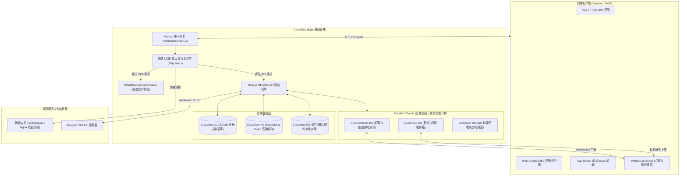

### 核心组件职责：
1. **Cloudflare Worker (Entrypoint)**：
   - 入口为 `worker/src/index.js`，采用 `run_worker_first = ["/*"]` 模式，所有流量首先进入 Worker。
   - 负责隐藏前缀过滤、反代伪装拦截、SPA 路由 404 回退至 `index.html`，以及动态注入 `<base href="/prefix/">`。
2. **Hono.js 后端框架**：
   - 极轻量的高性能边缘路由框架，承载认证鉴权、频道管理、用户资料、消息检索、附件上传及管理后台接口。
3. **Cloudflare D1 (Serverless SQLite)**：
   - 关系型持久化存储：用户数据 (`users`)、消息记录 (`messages`)、频道/群组 (`channels`, `channel_members`)、1v1 私信会话 (`dms`)、E2EE 身份公钥与密文备份 (`user_identity_keys`, `user_key_backups`, `crypto_envelopes`)、注册邀请 (`register_links`)、Schema 迁移记录 (`edgechat_schema_migrations`)。
4. **Cloudflare KV**：
   - 存储会话凭据 (`session:<token>`)，实现毫秒级鉴权与全局会话注销。
5. **Cloudflare R2**：
   - 存储用户头像、群头像、图片/音频/视频及通用文件附件，支持服务端 AES-256 与客户端端到端加解密。
6. **Cloudflare Durable Objects (DO)**：
   - 提供有状态单例（Actor 模型），维护长连接 WebSocket、房间在线列表、广播消息、未读通知投递与定期垃圾回收。

---

## 2. 隐藏入口与反代伪装系统 (Disguise Proxy)

为防御网络扫描、探测与未授权访问，Edgechat 内置了**零暴露隐藏入口（支持多路径前缀集合）与全自动反代伪装机制**（位于 `worker/src/disguise.js`）。

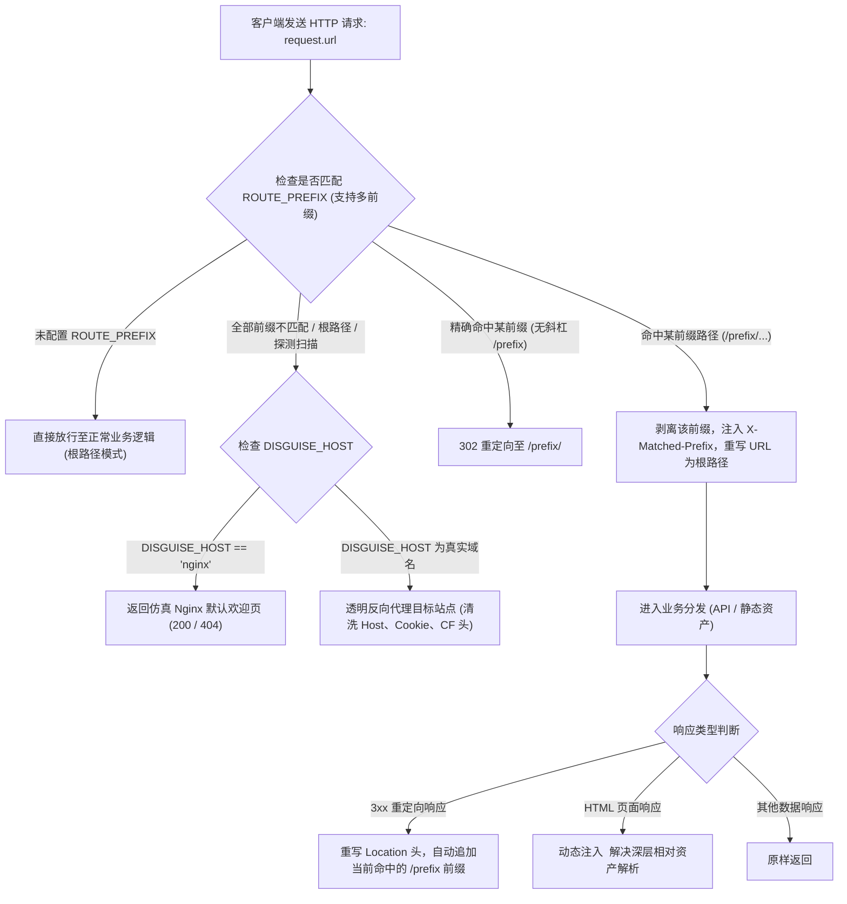

### 核心实现细节：
1. **多隐藏入口支持 (Multi-Route Entrances)**：
   - `ROUTE_PREFIX` 现已支持配置逗号、分号或空格分隔的多个入口（例如 `ROUTE_PREFIX = "secret1, portal_a, team_entry"`）；
   - 用户通过列表中的任意一个入口访问，均可无缝进入主项目，支持不同人员、部门或分流渠道分发专属入口。
2. **URL 前缀重写与上下文传递**：
   - 用户访问 `https://domain.com/secret1/api/channels` 时，伪装中间件将其解包为 `https://domain.com/api/channels` 并附加 `X-Matched-Prefix: secret1` 内部请求头交给 Hono 路由，业务层完全透明解耦。
3. **动态重定向 Location 修正**：
   - 若后端返回 `Location: /login`，中间件根据当前命中的入口自动重写为 `Location: /secret1/login`，避免用户跳转时脱离当前受保护的前缀范围。
4. **HTML `<base href>` 动态自适应注入**：
   - 针对邀请注册（`/:prefix/register/:token`）或后台深度路由（`/:prefix/admin/users`），Worker 拦截 `index.html` 响应并在 `<head>` 动态注入 `<base href="/:matchedPrefix/">`，确保浏览器加载 `<script src="./assets/index-xxx.js">` 时无论在哪个隐藏入口下均能准确定位静态资源，彻底消除 404 白屏。
5. **反代伪装请求清洗与仿真 Nginx**：
   - 反代外部目标站点时，自动清理 `cf-*`、`x-forwarded-*`、Cookie 等敏感头部；在 `DISGUISE_HOST = "nginx"` 时返回像素级仿真的 Nginx 200/404 官方原生页面，完全隐藏边缘 Serverless 特征。

---

## 3. 端到端加密体系 (E2EE Architecture)

Edgechat 实现了高标准现代密码学端到端加密（Zero-Knowledge Architecture），确保消息与文件即使在数据库被完全 Dump 的极端情况下，第三方与服务器管理员均无法解密。

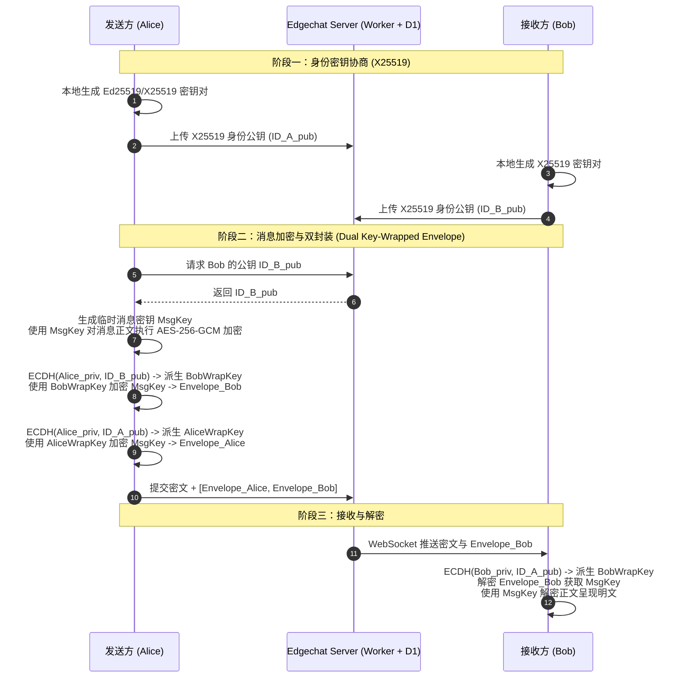

### 核心密码学机制：
1. **双层加密混合模型 (Two-Tier Encryption Model)**：
   - **公开群组 (Public)**：采用 **服务端静态落库加密 (At-Rest Encryption)**，Worker 使用 AES-256-GCM 主密钥加密存储到 D1，防止数据库裸露；同时具备密钥容错降级保护，单个消息异常不影响全局。
   - **私有群组与私聊 (Private / DM)**：采用 **客户端端到端加密 (Client-side E2EE)**，服务端完全无法解密，密文格式为 `edgechat:e2ee:v1:...`。
2. **身份密钥体系与单次消息多接收方信封 (Per-Message Multi-Recipient Envelope)**：
   - 客户端在浏览器 `IndexedDB (edgechat_crypto_v1)` 中持久化保存 X25519 身份私钥，免密刷新或重启浏览器无需重复输入密码；公钥发布到 D1 `user_identity_keys`。
   - 发送每条私有消息时，发件人在本地生成单次随机对称密钥（Message Key），并生成单次使用的临时密钥对（Ephemeral Keypair），分别与当前群内所有成员公钥协商并封装密钥。
   - **前向与后向保密**：成员被移出群聊后，后续新消息的信封中不再包含其密钥；新成员加入后，无法解密加入前的历史消息。
3. **零知识私钥口令派生云端备份 (Zero-Knowledge Key Backup)**：
   - 用户在本地通过登录密码（经 PBKDF2 100,000 次高强度迭代派生密钥）加密私钥并备份到 D1 `user_encrypted_key_backups`；在换用新设备/新浏览器初次登录时输入密码即可自动漫游解密恢复历史私钥。
4. **客户端附件零知识加密 (Zero-Knowledge Attachment Cipher)**：
   - 附件在前端内存中生成独立随机密钥通过 AES-256-GCM 加密，加密二进制流直接上传至 R2，下载时客户端在本地流式解密，云端仅见高熵加密二进制块。

---

## 4. 实时通信与状态同步机制 (WebSocket + Durable Objects)

Edgechat 采用 Cloudflare Durable Objects 构建了高并发、高弹性的实时长连接网络。

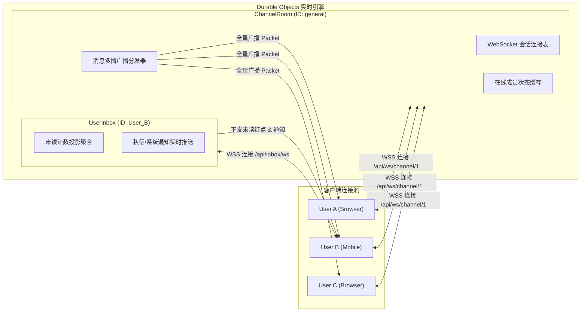

### 关键实现策略：
1. **ChannelRoom DO (`worker/src/do/ChannelRoom.js`)**：
   - **连接管理**：维护每个频道/私信房间内的 WebSocket 活跃连接；
   - **心跳机制**：服务端与客户端定时 Ping/Pong 保活，检测死连接并自动回收；
   - **广播分发**：接收到新消息、撤回、删除、成员加入等事件时，并行序列化 Packet 分发给全房间在线连接。
2. **UserInbox DO (`worker/src/do/UserInbox.js`)**：
   - **独立收件箱**：每个用户拥有独一无二的 UserInbox 实例；
   - **未读消息投影**：当用户在非活跃会话收到消息时，后端异步触发收件箱 DO，累加未读计数并向该用户所有已打开的终端推送通知更新。
3. **连接稳定性设计**：
   - 前端 WebSocket Client 具备**指数退避重连机制**；
   - 明确区分正常关闭（Policy Violation / 鉴权失效时**禁止重连**，引导重新登录）与网络波动（自动重连并同步最新离线状态）。

---

## 5. 数据流转与消息投递全链路

以下为一条消息从发送到多端接收的完整时序与状态流转：

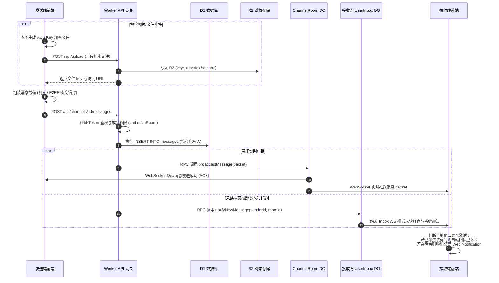

---

## 6. 跨会话消息转发与 E2EE 附件重加密管线

Edgechat 提供了安全的单条与批量消息转发能力（位于 `frontend/src/composables/useMessageForwarding.js` 与 `frontend/src/components/chat/ForwardMessageModal.vue`）。

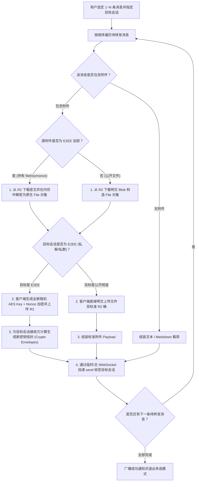

### 核心安全保障：
1. **内存级零知识解密与重加密**：
   - 私密会话中的附件在转发时绝不在服务端解密；由客户端浏览器在内存沙箱中利用原会话 Key 解密，再为目标会话受众计算全新的随机 Key 与 Nonce 加密上传，杜绝跨会话密钥重用。
2. **语音条元数据继承**：
   - 转发语音消息时，自动保留 `isVoice: true`、音频时长（`duration`）及波形数据，目标会话接收方可直接点击播放并支持连播。
3. **附言一并投递**：
   - 用户在转发弹窗输入的附言将作为首条消息附带发送，支持即时搜索与过滤全量会话与联系人。

---

## 7. 团队云盘与聊天生态联动体系 (EdgeChat Drive)

Edgechat 内置了高性能云盘系统（`worker/src/api/drive.js` 与 `frontend/src/pages/DrivePage.vue`），深度打通了即时通信与团队资产管理。

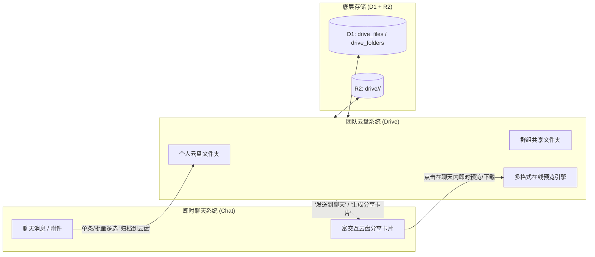

### 架构特性：
1. **聊天附件一键归档**：
   - 用户在聊天长按单条附件或多选批量消息时，可点击“归档到云盘”，选择目标目录后后台自动将 R2 文件索引引用或转存入 `drive_files`，无需重新上传。
2. **富交互分享卡片 (`DriveShareCard.vue`)**：
   - 从云盘选择文件分享到聊天时，生成带文件类型图标、体积、上传者信息的交互卡片，房间成员可直接在聊天流内点击唤起全屏预览或一键保存到自己的云盘。
3. **多格式在线预览引擎 (`DriveFilePreviewModal.vue`)**：
   - 原生支持图片（缩放/旋转）、音视频（流式播放）、PDF/文本/代码（语法高亮）在线预览。

---

## 8. 实时语音通话与群组会议 (WebRTC SFU Audio Calls)

Edgechat 结合 **Cloudflare Calls SFU** 实现了高可用、低延迟的实时语音通信（`frontend/src/composables/useAudioCall.js` 与 `worker/src/api/calls.js`）。

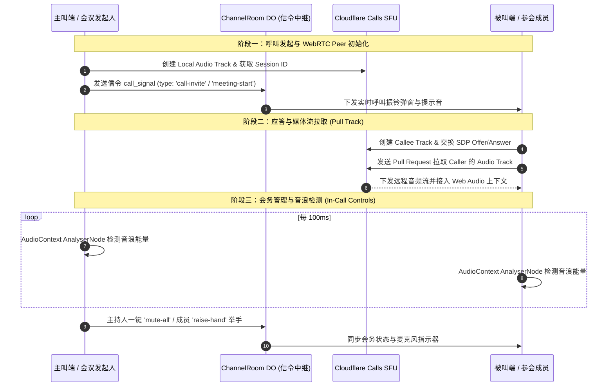

### 核心特性：
- **全局悬浮通话栏 (`AudioCallModal.vue`)**：在切换聊天会话、查看云盘或管理后台时，通话以浮动徽标保持运行，不中断音频链路；
- **群组会议主持人控制**：支持全员静音、举手审批、踢出参会者及入会群广播；
- **低资源消耗**：SFU 架构下每个客户端仅需上传 1 路音频流，由边缘网络分发，移动端低发热低耗电。

---

## 9. 音频 DSP 变声器与微信语音条播放引擎

Edgechat 为语音条与实时通话内置了纯前端 **Web Audio DSP 变声引擎**（`frontend/src/audio/voice-effects.js`）。

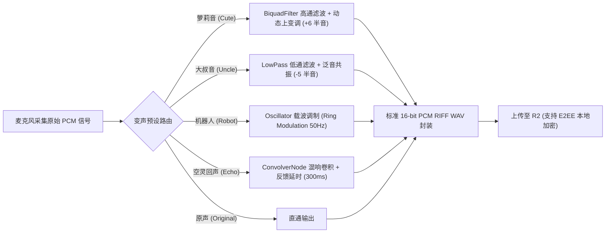

### 微信风格语音条交互 (`VoiceMessageBubble.vue` & `useVoiceRecorder.js`)：
1. **按住说话与上滑取消**：
   - 移动端与桌面端支持按住录音、手指上滑超过阈值触发取消 HUD、不足 1 秒自动拦截提示“说话时间太短”；
2. **动态音频波形与红点**：
   - 录制时根据音量生成 3 段动态跳动波浪柱，未读语音条显示红色未读指示点；
3. **连续自动播放队列 (`useVoicePlayer.js`)**：
   - 点击一条未读语音后，播放完毕自动定位并无缝播放下一条未读语音。

---

## 10. 群聊色彩调色盘与已读回执同步机制

Edgechat 重新设计了多成员群聊的消息辨识度与状态确认体系：

### 1. 12 色高对比度群成员专属调色盘 (`SENDER_PALETTES`)
- 在群聊中根据成员 ID/用户名生成唯一、稳定的调色盘索引；
- **浅色模式**：柔和粉彩渐变背景 + 协调边框，搭配深色文字；
- **暗黑模式**：深邃暗夜底色 + 对应色彩的高亮发光边框，本人消息始终保持经典高亮绿泡，彻底告别单调白底与辨识困难。

### 2. 多层级已读水位同步机制
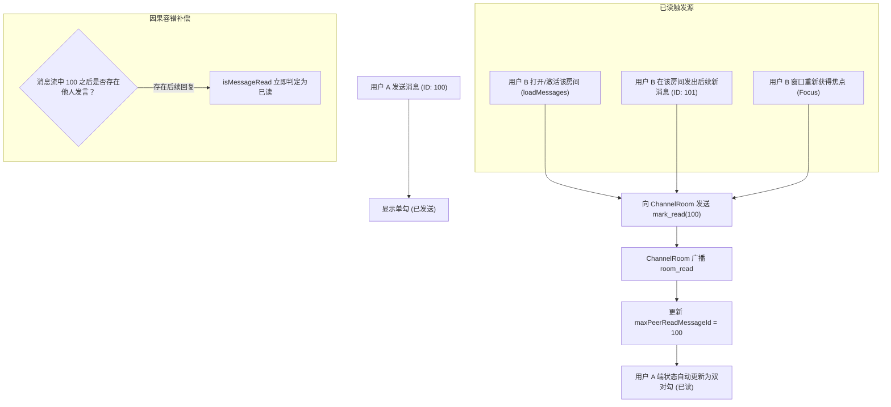

---

## 11. 流量混淆与元数据隐私保护 (Traffic Obfuscation)

为了防御网络监听者通过报文长度与时序分析猜测用户交互行为，Edgechat 在 `traffic-obfuscation.js` 中构建了**流量混淆与整形层**：

1. **定长数据桶填充 (Bucket Padding)**：
   - 所有 WebSocket 出站消息均自动对齐填充至标准阶梯尺寸（256B、1024B、4096B），阻断利用特定文字长度推测聊天内容的侧信道分析；
2. **双向诱饵流量 (Cover Traffic)**：
   - 在长连接空闲期随机生成仿冒数据包向服务端发送并原路丢弃，扰乱流量时序特征；
3. **输入状态队列整形**：
   - 对“正在输入中 (typing)”状态进行防抖合并与发送窗口整流，避免频繁微小报文泄露键盘打字节奏。

---

## 12. Telegram 双向互通网桥 (Telegram Bridge)

Edgechat 原生集成了 Telegram 机器人双向网桥（`worker/src/integrations/telegram/`），实现群聊无缝互通。

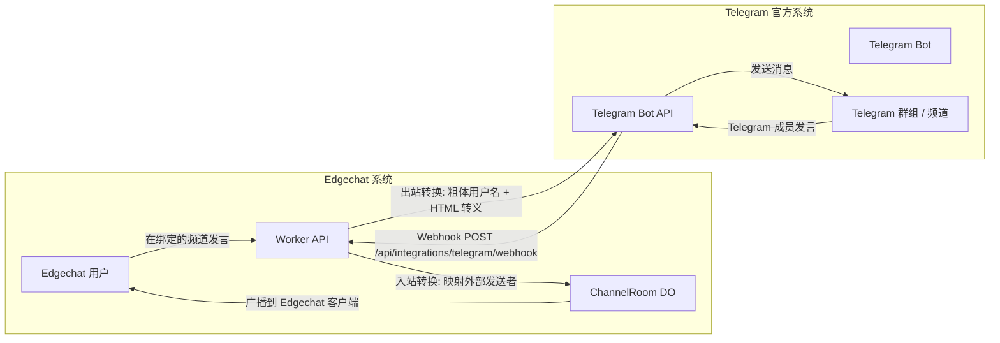

### 网桥核心能力：
1. **安全 Webhook**：
   - 动态读取 `ROUTE_PREFIX` 注册 Webhook（如 `/edgechat/api/integrations/telegram/webhook`）；
   - 使用用途绑定的服务端密文校验 `X-Telegram-Bot-Api-Secret-Token`，杜绝未授权伪造请求。
2. **头像 Edge Cache 优化**：
   - 提供 `/api/integrations/telegram/avatar/:userId` 端点，通过 Cloudflare 边缘缓存（`s-maxage=86400`）最大尺寸头像，避免重复调用 Telegram API。
3. **媒体与附件转发**：
   - Telegram 图片/视频入站时由 Worker 自动下载并转存至 R2，生成合法的 Edgechat 媒体消息。

---

## 13. 管理后台与 R2 存储统计体系

Edgechat 提供了全面的管理后台功能（位于 `frontend/src/pages/admin/` 与 `worker/src/api/admin.js`）：

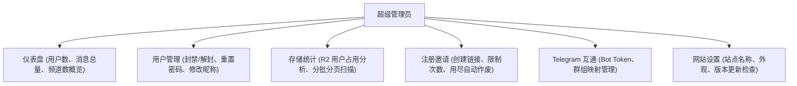

### R2 存储流式统计逻辑 (`worker/src/storage-statistics.js`)：
- 面对数以万计的对象文件，直接全量聚合会导致 Worker 内存溢出或 CPU 超时；
- Edgechat 采用**分页流式游标扫描（Cursor-based Bucket Scan）**：
  - 前端发起 `/api/admin/storage/scan?cursor=xxx`；
  - 后端向 R2 请求单页（如 1000 个对象），在边缘内存中聚合出各用户 ID 占用的字节数与文件数；
  - 前端收到后递增合并到视图中，支持随时暂停与断点续扫，直观呈现存储消耗分布。

---

## 14. 自动化部署、环境适配与数据库迁移

Edgechat 配套了工业级 Linux 自动化运维部署脚本（[deploy_edgechat_Linux.sh](file:///home/user/文档/Edgechat/deploy_edgechat_Linux.sh)）。

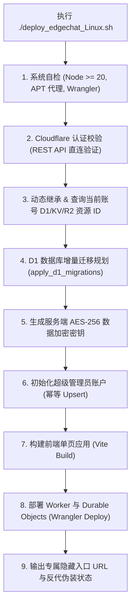

### 部署脚本核心特性：
1. **多账号防串号隔离**：
   - 每次部署均通过当前 API 凭据向 Cloudflare REST API 查询真实的 D1/KV 资源 ID，并动态重写 `wrangler.toml`，避免切换账号时读到旧账号数据。
2. **强力引号脱敏 (`strip_quotes`)**：
   - 彻底剥离环境变量、配置文件及命令行传参中可能存在的多重引号，防止 Wrangler 向 Cloudflare API 发送 `/accounts/"id"/...` 导致 7003 路由错误。
3. **智能迁移规划 (Idempotent Migrations)**：
   - 自动对比 `edgechat_schema_migrations` 记录表，跳过已执行的 SQL 脚本，避免触发 `UNIQUE constraint failed` 异常。

---

## 总结

Edgechat 融合了现代 **Serverless 边缘计算**、**端到端密码学安全** 与 **自适应网络反代伪装** 技术：
- **在性能上**：全球就近接入，毫秒级响应，DO 长连接稳定高效；
- **在安全上**：隐藏前缀 + 热门站点反代伪装，结合 X25519/AES-256 E2EE 零知识加密；
- **在运维上**：一键式多账号自适应部署与无感热更新，是下一代边缘协同通讯系统的完整实践。
